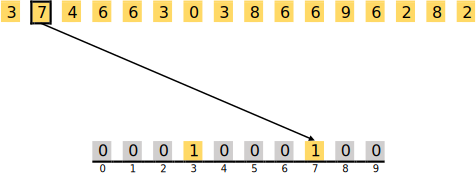

><p align="center">
  
</p>


# TP02: Manipulation de tableaux de caractères et algorithme avancés
- [Directives particulières](#directives)
- [Introduction](#introduction)
- [Objectifs](#objectif) 
- [Énoncé de travail](#enonce)
  - [Tri Par Comptage](#comptage)
  - [Recherche dichotomique](#dichotomique)
- [Gestion de la pile](#pile)
- [Outils de validation](#outil)
- [Sous-programmes à implémenter](#fonction)
- [Resultats attendus](#resultat)
- [Remise](#remise)
- [Barème](#bareme)

:alarm_clock: [Date de remise le dimanche 14 avril à 23h59](https://www.timeanddate.com/countdown/generic?iso=20240414T235959&p0=165&font=cursive)

# Directives particulières <a name="directives"></a>
* Le travail doit être effectué en équipe de 2 à 4 personnes.
* Respecter le [guide de codage](https://ena.etsmtl.ca/pluginfile.php/1984632/mod_resource/content/1/TCH017%20-%20Normes%20de%20programmation.docx.pdf)
* Noms de variables et fonctions adéquats (concis, compréhensibles);
* Documentation du code
* Liens utiles:
  * [Tri Par Comptage](https://fr.wikipedia.org/wiki/Tri_comptage)
  * [Recherche dichotomique](https://fr.wikipedia.org/wiki/Recherche_dichotomique#:~:text=La%20recherche%20dichotomique%2C%20ou%20recherche,%C3%A9l%C3%A9ment%20dans%20un%20tableau%20tri%C3%A9.)

  
# 1. Introduction <a name="introduction"></a>

<div align="justify">
Dans une ère caractérisée par l'expansion rapide des données numériques, leur traitement et analyse minutieux deviennent indispensables à l'avancement scientifique et technologique. La capacité à extraire des informations significatives et à prendre des décisions éclairées repose largement sur l'efficacité des algorithmes, qui sont au cœur des processus d'analyse de données. Face à l'augmentation de la complexité et du volume des données, l'amélioration continue de ces algorithmes s'impose comme une nécessité pour en renforcer l'efficacité et la fiabilité.<br><br></div>

<div align="justify">
Ce projet se concentre sur l'étude de deux méthodologies algorithmiques fondamentales dans le domaine du traitement des données :

- **Le tri par comptage :** Une méthode de tri extrêmement efficace pour les données dont la distribution se situe dans un intervalle bien défini, offrant des performances remarquables en termes de vitesse et d'efficacité.
- **La recherche dichotomique :** Une méthode de recherche rapide et précise au sein d'ensembles de données triés, optimisant le temps de recherche et minimisant les ressources nécessaires.</div>

<div align="justify">
Au-delà de l'étude de ces méthodologies, ce projet est conçu pour explorer l'univers de la gestion de données via le langage de programmation PEP/8, offrant une opportunité unique pour le développement de compétences avancées en manipulation de données, en algorithmique, et en programmation structurée. Cette initiative permet d'acquérir une maîtrise des techniques fondamentales de traitement des données et de comprendre leur application pratique dans divers contextes, ouvrant ainsi la voie vers des analyses plus poussées et des prises de décision informées.</div>

<div align="justify">

# 2. Objectifs du Projet <a name="objectif"></a>

Ce projet vise à atteindre les objectifs suivants :

- **Explorer la manipulation des fonctions en langage assembleur PEP/8**, incluant une compréhension approfondie du passage de paramètres par valeur et par adresse, ainsi que de la gestion de la pile et du traitement des résultats.
- **Adhésion aux standards de programmation** : Encourager l'adoption des meilleures pratiques de programmation, y compris le respect des conventions de codage et la production d'un code clair, maintenable, et efficace.
- **Développer des compétences en manipulation de données** en utilisant des techniques avancées de programmation pour gérer et analyser efficacement les données numériques.
- **Appliquer des connaissances théoriques à des scénarios pratiques**, permettant aux étudiants de consolider leur compréhension des systèmes informatiques et d'affiner leurs compétences en programmation PEP/8.
- **Maîtriser l'algorithme du tri par comptage** pour traiter efficacement des ensembles de nombres entiers, en appliquant une méthode originale basée sur la création et l'utilisation d'un histogramme.
- **Implémenter la recherche dichotomique** afin de fournir une méthode rapide et précise pour la recherche dans des ensembles de données triés, optimisant ainsi le temps de recherche et minimisant les ressources nécessaires.
</div>

# 3. Énoncé de travail <a name="enonce"></a>

<div align="justify">
  
Dans ce contexte, notre travail s'articule autour de l'implémentation et de l'analyse de deux techniques algorithmiques fondamentales : le tri par comptage et la recherche dichotomique. L'objectif est double : d'une part, démontrer l'efficacité de ces méthodes dans le traitement des données numériques, et d'autre part, explorer leur mise en œuvre dans un langage de bas niveau, tel que l'assembleur PEP/8. Cette démarche permet non seulement d'appréhender les principes sous-jacents à ces techniques, mais aussi de comprendre les défis liés à leur application directe sur des structures de données en mémoire. 

</div>


## 3.1. Tri Par Comptage (Counting Sort) <a name="comptage"></a>

<div align="justify">
  
Le tri par comptage, ou tri par dénombrement, est mis en avant comme une technique de tri algorithmique particulièrement efficace pour les ensembles de nombres entiers contenus dans une plage de valeurs déterminée. Cette méthode se distingue par son approche originale, qui débute avec la création d'un histogramme reflétant la fréquence d'apparition de chaque nombre dans l'ensemble à trier. L'exploitation de cet `histogramme` permet ensuite de reconstituer l'ensemble trié de manière ordonnée. L'un des avantages majeurs du tri par comptage réside dans sa capacité à trier les données sans nécessiter une comparaison directe entre les éléments, offrant ainsi une efficacité notable pour les ensembles de grande taille limités à une étendue de valeurs restreinte.

</div>

### 3.1.1. Algorithme du Tri Par Comptage

<div align="justify">
Le déroulement du tri par comptage s'effectue selon des étapes systématiques :
</div>

 <div align="justify">


1. **Détermination de la borne maximale et minimale :** Identifie les valeurs extrêmes dans l'ensemble de données pour ajuster la taille du tableau auxiliaire pour le comptage.
2. **Initialisation du tableau de comptage :** Prépare un tableau auxiliaire couvrant toutes les valeurs potentielles entre les bornes extrêmes, initialisé à zéro.
3. **Complétion du tableau de comptage :** En parcourant l'ensemble de données, chaque observation augmente le compteur correspondant dans le tableau auxiliaire, créant un `histogramme` des fréquences.
4. **Assemblage du tableau trié :** Reconstruit l'ensemble de données en ordre croissant, basé sur les informations de l'`histogramme`.

</div>

<div align="justify">
Une implémentation en pseudo-code du tri par comptage est présentée ci-après :
</div>

<p align="center">
    
</p>


### 3.1.2. Exemple détaillé de Tri Par Comptage
<div align="justify">
Imaginons un ensemble de données constitué de nombres variant de 0 à 9, avec l'intention de le trier en utilisant la méthode du tri par comptage.
<br><br></div>

<p align="center">
  
</p>

<ins>**Algorithme de Tri Par Comptage – Phase 1 : Comptage des Éléments**</ins><br>

<div align="justify">
  
  La première phase consiste à préparer un tableau auxiliaire de dix éléments (pour correspondre à l'intervalle de valeurs de 0 à 9), tous initialisés à zéro. Chaque indice de ce tableau correspond à une valeur potentielle dans l'ensemble de données.
  
</div>

<p align="center">
  
</p>

<div align="justify">

  En parcourant l'ensemble de données, on augmente la valeur correspondante dans le tableau auxiliaire pour chaque occurrence d'un élément. Ce processus est répété pour chaque élément, résultant en un `histogramme` qui reflète la fréquence de chaque valeur.
  
</div>

<p align="center">
  
</p>

<div align="justify">

  Pour l'élément suivant, qui est un 7, l'opération consiste à incrémenter la valeur à l'indice 7 du tableau auxiliaire.
  
  </div>

<p align="center">
  
</p>

<div align="justify">
Les éléments 4 et 6 sont traités de manière similaire, avec une incrémentation des valeurs des indices 4 et 6 respectivement :</div>

<p align="center">
  
</p>

<div align="justify">
Les éléments suivants, 6 et 3, déjà comptabilisés auparavant, voient leurs indices correspondants dans le tableau auxiliaire augmenter de 1 à 2 :</div>

<p align="center">
  
</p>

<div align="justify">
Ce principe étant établi, après traitement de tous les éléments, le tableau auxiliaire présente finalement l'aspect suivant :</div>

<p align="center">
  
</p>

<div align="justify">
  
À l'issue du traitement de tous les éléments, le tableau auxiliaire illustre un `histogramme` complet de la distribution des valeurs dans l'ensemble de données, indiquant précisément combien de fois chaque valeur apparaît.<br><br>
</div>

Les occurrences dans l'ensemble à trier se présentent comme suit :
- 1 fois le 0,
- 0 fois le 1,
- 2 fois le 2,
- 3 fois le 3,
- 1 fois le 4,
- 0 fois le 5,
- 5 fois le 6,
- 1 fois le 7,
- 2 fois le 8, et
- 1 fois le 9.

Ces données seront exploitées dans la phase 2 pour réarranger le tableau à trier.

<ins>**Algorithme de Tri Par Comptage – Phase 2 : Réorganisation des Éléments**</ins> <br>
<div align="justify">

La deuxième phase utilise l'`histogramme` pour assembler l'ensemble trié. En parcourant le tableau auxiliaire, on place chaque valeur dans l'ensemble final autant de fois que son nombre d'occurrences indiqué dans l'`histogramme`. Ce processus aboutit à un ensemble de données méthodiquement organisé.

</div>

<p align="center">
  
</p>

<div align="justify">

Pour illustrer, on commence avec l'indice 0 du tableau auxiliaire, où se trouve un 1, ce qui signifie que le nombre 0 est inséré une fois dans l'ensemble à trier. 

Pour illustrer, le processus débute à l'indice 0 du tableau auxiliaire, où se trouve un 1. Par conséquent, le chiffre 0 est inscrit une fois dans l'ensemble à trier.</div>

<p align="center">
  
</p>

<div align="justify">
  
L'absence de valeurs à l'indice 1 (valeur 0 dans l'`histogramme`) indique qu'aucun 1 n'est ajouté à l'ensemble. 
</div>

<p align="center">
  
</p>

<div align="justify">
  
L'indice 2 de l'`histogramme` qui compte un 2, cela conduit à insérer deux fois le chiffre 2 dans l'ensemble :</div>
</div>

<p align="center">
  
</p>

<div align="justify">
Arrivé à l'indice 3, qui compte un 3, cela conduit à insérer trois fois le chiffre 3 dans l'ensemble :</div>

<p align="center">
  
</p>

<div align="justify">
  
Ce processus continue avec chaque indice de l'`histogramme`, ajoutant les nombres dans l'ensemble à trier en fonction de leur fréquence d'occurrence. Finalement, cela résulte en un ensemble de données soigneusement trié, démontrant l'efficacité du tri par comptage.</div>

<p align="center">
  
</p>


## 3.2. Recherche dichotomique <a name="dichotomique"></a>

<div align="justify">
La recherche dichotomique représente une avancée importante dans les méthodes de recherche algorithmique, visant à identifier rapidement un élément donné au sein d'un ensemble trié. Cette approche est similaire à la méthode utilisée pour trouver un nom dans un annuaire téléphonique, ciblant des informations spécifiques liées à un identifiant prédéfini.<br><br>

Grâce à sa stratégie de réduction progressive de l'espace de recherche, la recherche dichotomique excelle dans l'examen d'ensembles de données agencés de manière séquentielle, offrant une efficacité notable en termes de rapidité et de précision comparée aux techniques conventionnelles.
</div>


### 3.2.1. Approche Naïve vs Approche Dichotomique

#### 3.2.1.1. Recherche Naïve

<div align="justify">
L'approche naïve, basée sur le parcours séquentiel de chaque élément d'un tableau pour trouver une valeur déterminée, est intuitivement simple, mais devient inefficace avec l'augmentation de la taille de l'ensemble de données. Elle repose sur une recherche linéaire, comparant successivement chaque élément à la valeur recherchée jusqu'à trouver une correspondance ou conclure à son absence. Facile à comprendre, cette méthode présente cependant une complexité linéaire, rendant le temps de recherche proportionnel à la taille de l'ensemble.
</div>

```c++
int Rech_nai(int tab[], int taille, int val) {
    for (int i = 0; i < taille; i++) 
        if (tab[i] == val) 
            return i;
    return -1;
}
```

#### 3.2.1.2. Recherche dichotomique

<div align="justify">
La recherche dichotomique applique une stratégie de division successive en deux de l'espace de recherche, commençant son opération par l'évaluation de l'élément situé au centre du tableau. Si cet élément central ne correspond pas à la valeur recherchée, la recherche se poursuit dans la moitié du tableau appropriée, choisie en fonction du résultat de la comparaison entre cet élément et la valeur cible. Cette approche itérative, qui diminue de moitié la taille de l'espace de recherche à chaque tour, permet de localiser rapidement la valeur recherchée ou de confirmer son absence, exploitant l'organisation préalable des données pour optimiser la vitesse de la recherche.
</div>

<p align="center">
    
</p>


### 3.2.2. Vérification de l'Applicabilité de la Recherche dichotomique

<div align="justify">La recherche dichotomique est appréciée pour sa capacité à identifier rapidement des éléments dans des ensembles de données structurés. Afin d'assurer cette efficience, il est impératif de valider deux critères fondamentaux : la garantie de terminaison de l'algorithme et la fiabilité des résultats.</div>
<div align="justify">
  
1. **Terminaison de la Boucle** : 
La terminaison repose sur l'utilisation d'un `variant de boucle`, assurant une réduction constante de l'espace de recherche après chaque itération. Ce mécanisme garantit une décroissance systématique et évite un fonctionnement infini de l'algorithme, promettant ainsi une issue en un nombre fini d'étapes.

2. **Exactitude des Résultats** : 
L'exactitude garantit que l'indice renvoyé, le cas échéant, correspond réellement à l'élément recherché ou indique correctement son absence. Cette assurance de précision établit la fiabilité de la recherche dichotomique dans l'examen d'ensembles préalablement triés.<br><br></div>

<div align="justify">Le respect rigoureux de ces critères confirme l'efficacité de la recherche dichotomique pour fournir des résultats justes et fiables. La stratégie de division efficace de l'espace de recherche accélère la convergence vers l'élément cible ou confirme son absence, grâce à une réduction exponentielle de la zone d'examen à chaque étape.<br><br></div>

<div align="justify">Le processus de vérification se base sur :

1. La détermination du milieu par `milieu = (gauche + droite) // 2`, en s'assurant que `gauche <= milieu <= droite`.
2. Trois possibilités émergent :
   - Si `tab[milieu] = val`, l'élément est trouvé, concluant la recherche.
   - Si `tab[milieu] > val`, la recherche se concentre sur la moitié inférieure, réajustant `droite` à `milieu - 1` pour réduire l'espace de recherche.
   - Si `tab[milieu] < val`, l'investigation se poursuit dans la moitié supérieure, avec `gauche` ajusté à `milieu + 1`.<br><br></div>

<div align="justify">Ces étapes facilitent une diminution méthodique de l'espace de recherche, assurant ainsi la finitude de l'algorithme et l'exactitude des conclusions.</div>


### 3.2.3. Exemple détaillé de la recherche dichotomique

<div align="justify">
Considérons la recherche du chiffre 56 dans un tableau ordonné pour illustrer la recherche dichotomique. Cette méthode démarre par l'évaluation de l'élément au milieu du tableau. Si la valeur recherchée est supérieure à cet élément central, l'analyse se recentre sur la moitié supérieure du tableau, et vice versa. Ce procédé est répété, réduisant progressivement l'espace de recherche jusqu'à ce que la valeur désirée soit trouvée ou que l'on conclue à son absence.
</div>

<p align="center">
  
</p>

<div align="justify">
Initialement, l'élément médian, ici 45, est examiné. La valeur cible étant plus élevée que 45, la recherche se focalise sur la partie droite du tableau, limitant ainsi l'espace de recherche aux valeurs 48, 56, 60, 79, et 86.</div>

<p align="center">
  
</p>

<div align="justify">
Lors de la deuxième étape, l'élément au centre du sous-ensemble (48, 56, 60, 79, 86) est 60. Puisque 60 est plus grand que le chiffre recherché, l'attention se déplace vers la moitié gauche du sous-ensemble, comprenant 48 et 56.</div>

<p align="center">
  
</p>

<div align="justify">
Dans l'étape finale, avec seulement 48 et 56 restants, et l'élément médian étant 48, qui est inférieur à la valeur cherchée, la logique conduit à la conclusion que le chiffre suivant, 56, est l'élément recherché. L'algorithme s'achève ainsi avec succès.</div>

<p align="center">
  
</p>

<div align="justify">
Cet exemple met en lumière l'efficacité de la recherche dichotomique, capable de localiser rapidement un élément dans un tableau ordonné par la diminution méthodique de l'espace de recherche, illustrant la puissance de l'approche diviser pour mieux régner propre aux algorithmes de recherche.
</div>


# 4. Gestion de la pile <a name="pile"></a>


<div align="justify">
La gestion efficace de la mémoire est essentielle en programmation PEP/8, en particulier pour la manipulation de données structurées comme les tableaux. À titre d'exemple, la  pile est un espace de stockage temporaire utilisé pour écrire des données. L'accent est mis sur la manipulation de trois tableaux de caractères ASCII, nécessitant chacun une quantité spécifique d'octets pour leur stockage.</div>

## 4.1. Préparation de la pile :
<div align="justify">
Un espace sera réservé dans la pile pour trois tableaux de caractères ASCII, nécessitant respectivement 10, 20 et 30 octets pour leur stockage.</div>
  
```asm
a_tab1: .ASCII  "Allo!"           ; Tableau 1  [65 108 108 111 33]
a_tab2: .ASCII  "Message!!!"      ; Tableau 2: [77 101 115 115 97 103 101 33 33 33]
a_tab3: .ASCII  "Bonjour TCH017!" ; Tableau 3: [66 111 110 106 111 117 114 32 84 67 72 48 49 55 33]
```

## 4.2. Chargement des tableaux dans la pile:
<div align="justify">
Pour faciliter la gestion des emplacements et des dimensions des tableaux dans la pile, nous définissons des constantes telles que `a_tai1, a_tai2, a_tai3, a_ad_t1, a_ad_t2, et a_ad_t3`. Ces définitions permettent de manipuler de manière dynamique les adresses et les tailles des tableaux pendant leur chargement, assurant ainsi une gestion mémoire flexible et efficace.</div>

```asm
a_tai1:  .EQUATE 10     ; Taille en octets du tableau 1.
a_tai2:  .EQUATE 20     ; Taille en octets du tableau 2.
a_tai3:  .EQUATE 30     ; Taille en octets du tableau 3.
a_tai4:  .EQUATE 256    ; Taille en octets de l'histogramme.

a_ad_t1: .EQUATE 0      ; Adresse du premier élément du tableau 1 dans la pile.
a_ad_t2: .EQUATE 10     ; Adresse du premier élément du tableau 2 dans la pile.
a_ad_t3: .EQUATE ?      ; Adresse du premier élément du tableau 3 dans la pile.
a_ad_his:.EQUATE ?      ; Adresse du premier élément de l'histogramme dans la pile.
```

<div align="justify">
Le processus de chargement des tableaux dans la pile est une étape clé qui implique la réservation de l'espace nécessaire pour chaque tableau. Cette opération s'effectue en ajustant le pointeur de pile selon la taille totale requise pour les données, puis en consignant l'adresse de départ et la taille de chaque tableau à un emplacement spécifique dans la pile. Cette méthode assure une utilisation optimale de l'espace de pile disponible et permet un accès rapide et efficace aux données stockées.</div>   

**Exemple de chargement pour le tableau 1 :**

<div align="justify">L'ajustement du pointeur de pile est une étape préliminaire cruciale, ici illustrée par l'extension de 10 octets pour accommoder le tableau 1. Cette manipulation est essentielle pour réserver l'espace nécessaire dans la pile, permettant ainsi de noter avec précision l'adresse de départ et la taille du tableau. Cette procédure garantit que les données soient organisées de manière cohérente et accessible.</div>

<p align="center">
  
</p>

<div align="justify">En suivant cette méthode pour chaque tableau, nous assurons une addition structurée des données dans la pile. Cette approche systématique favorise une organisation logique et efficace, facilitant l'accès et la manipulation des données stockées.<br><br></div>     

<div align="justify">
La finalisation du chargement de tous les tableaux résulte en une configuration ordonnée de la pile, où chaque tableau est empilé successivement. L'illustration ci-après offre une vue d'ensemble de la disposition des tableaux dans la pile après le processus de chargement, mettant en évidence l'agencement méthodique et l'utilisation optimale de l'espace de stockage temporaire.</div>

<p align="center">
  
</p>

<div align="justify">
Cette démarche méthodologique souligne l'importance d'une gestion précise et réfléchie de la pile, essentielle pour le traitement efficace des structures de données complexes dans des environnements où l'optimisation de l'espace mémoire est primordiale.</div>

## 5 Outils de validation : <a name="outil"></a>
<div align="justify">Afin de s'assurer de la précision des opérations réalisées dans ce projet, divers outils de visualisation disponibles dans l'environnement de développement PEP/8 seront employés.
  
- **Vue Memory Dump** : Cet outil s'avère crucial pour l'examen direct du contenu de la mémoire, permettant de confirmer que les valeurs sont correctement stockées dans les tableaux. Il facilite ainsi la validation manuelle de l'exactitude des données insérées.

- **Fenêtre Output** : Cette fenêtre est utilisée pour observer les résultats définitifs des tableaux après leur traitement. Elle fournit un aperçu précis des changements effectués sur les données, à la suite des processus de tri et de recherche.</div>

# 6. Sous-programmes à implémenter <a name="fonction"></a>

<div align="justify">
Pour assurer une construction organisée et une exécution efficace du programme, il est essentiel d'adopter une approche structurée, divisant le travail en sous-programmes spécifiques. Cette méthodologie ne favorise pas seulement une meilleure compréhension du mécanisme interne du programme, mais elle augmente également sa modularité, ce qui est avantageux pour d'éventuelles modifications ou expansions futures. La première étape consiste à se concentrer sur les sous-tâches fondamentales, qui serviront de base sur laquelle les fonctionnalités plus complexes seront développées. <br><br>

Pour une compréhension approfondie et une validation efficace de la logique de programmation, il est vivement recommandé d'entamer le processus par l'implémentation et le test des sous-programmes en C ou en Java. Cette démarche, bien qu'elle représente une étape supplémentaire, s'avère indispensable pour assurer la solidité et l'exactitude de la logique avant de procéder à la traduction en PEP/8.</div>


  
## 6.1. Sous-Tâches de Base :

<div align="justify">
  
Il est recommandé de commencer par les sous-tâches simples qui permettent la lecture, le chargement des tableaux dans la pile, ainsi que leur manipulation.  

</div>


 <div align="justify">
   
### Chargement des tableaux: A_LECTUR (16 Points) 

   Cette fonction charge un tableau de caractères ASCII, les convertit en valeurs décimales, et place les éléments convertis dans l'emplacement approprié dans la pile.
     
  **Paramètres :**
   - `a_tab`  : Adresse du début du tableau ASCII en mémoire.
   - `a_tai`  : Taille du tableau, indiquant le nombre de caractères ASCII à convertir.
   - `a_ad_t` : Adresse dans la pile où les éléments convertis en décimale doivent être placés.

   
   **Retour :**
   - Aucune valeur retournée directement. Les éléments convertis en décimale sont positionnés à l'adresse spécifiée dans la pile.

</div>


 <div align="justify">
   
### Affichage des tableaux: A_AFFICH (10 Points) 

   Fonction destinée à afficher le contenu d'un tableau en format décimal.
     
   **Paramètres :**
   - `a_ad_t`: Adresse dans la pile du premier élément du tableau à afficher.
   - `a_tai` : Taille du tableau, indiquant le nombre d'éléments à afficher.
   
   **Retour :**
   - Aucune valeur retournée. Les éléments du tableau sont affichés en format décimal. 

</div>

---


 <div align="justify">
   
### Valeur minimale d'un tableau: A_MINIM (7 Points) 

   Fonction dédiée à la recherche de la valeur minimale au sein d'un tableau.
     
   **Paramètres :**
   - `a_ad_t`: Adresse dans la pile du premier élément du tableau à examiner.
   - `a_tai` : Taille du tableau, déterminant le nombre d'éléments à analyser.
   
   **Retour :**
   - `a_min` : Contient la valeur minimale identifiée dans le tableau.

</div>

---

 <div align="justify">
   
### Valeur maximale d'un tableau: A_MINIM (7 Points) 

   Fonction dédiée à la recherche de la valeur maximale au sein d'un tableau.
     
   **Paramètres :**
   - `a_ad_t`: Adresse dans la pile du premier élément du tableau à examiner.
   - `a_tai` : Taille du tableau, déterminant le nombre d'éléments à analyser.
   
   **Retour :**
   - `a_max` : Contient la valeur maximale identifiée dans le tableau.

</div>


---


 <div align="justify">
   
### Fréquence des éléments d'un tableau: A_HISTO (20 Points) 

   Fonction permettant de calculer la fréquence des éléments d'un tableau et de réorganiser ces derniers à l'aide d'un `histogramme`.
     
   **Paramètres :**
   - `a_ad_t`  : Adresse dans la pile du premier élément du tableau à analyser.
   - `a_tai`   : Taille du tableau, précisant le nombre d'éléments à évaluer.
   - `a_ad_his`: Adresse dans la pile où débutera l'histogramme, recensant la fréquence de chaque élément du tableau.
   
   **Retour :**
    - Aucune valeur retournée directement. Le tableau est restructuré selon l'`histogramme` et les éléments sont repositionnés à l'adresse indiquée dans la pile.

</div>


## 6.2. Procédures de Tri et Recherche :
<div align="justify">Une fois les sous-tâches de base réalisées, il est nécessaire d'implémenter les procédures de tri et de recherche suivantes :</div>

<div align="justify">
  
### Algorithme trie par comptage: A_TRICOM (20 Points) 

   Procédure dédiée à l'exécution du tri par comptage.
   
   **Paramètres :**
   - `a_ad_t`   : Adresse dans la pile du premier élément du tableau à trier.
   - `a_tai`    : Taille du tableau, définissant le nombre d'éléments à ordonner.
   - `a_ad_his` : Adresse dans la pile destinée à l'histogramme, recensant la fréquence de chaque élément du tableau.
  
   **Retour :**
   - Aucune valeur n'est retournée directement. Les éléments du tableau sont ordonnés et actualisés à leur position respective sur la pile.

</div>


---

<div align="justify">
  
### Algorithme de recherche dichotomique: A_RECHDI (20 Points) 

   Procédure conçue pour réaliser une recherche dichotomique, visant à identifier une valeur spécifique au sein d'un tableau déjà trié.   
     
   **Paramètres :**
   - `a_ad_t`  : Adresse dans la pile du premier élément du tableau trié.
   - `a_tai`   : Taille du tableau, précisant le nombre d'éléments inclus dans la recherche.
   - `a_cible` : La valeur recherchée dans le tableau.
   
   **Retour :**
   - `a_indice` : Indique la position de l'élément recherché dans le tableau, si celui-ci est trouvé.

</div>


## 7. Resultats attendus: <a name="resultat"></a>

<div align="justify">
Dans cette section, les résultats escomptés sont présentés à travers diverses étapes de manipulation et d'analyse des données contenues dans les tableaux. Cela comprend la lecture et le tri de ces tableaux, ainsi que la réalisation de recherches spécifiques au sein de ces structures de données organisées. Les résultats attendus sont illustrés par des aperçus de l'état de la mémoire à différentes phases du traitement, offrant une vision claire des transformations subies par les données. Des captures d'écran de la console sont fournies pour visualiser le résultat final de ces opérations.</div>

### 7.1. Lecture et tri de tableaux:

<ins> **Cas 1: Lecture et tri du tableau 1:** </ins>

<div align="justify">L'opération initiale consiste à lire les données du tableau 1 et à les placer dans la pile selon les emplacements définis. Cette démarche prépare les données pour les traitements à venir. Après cette lecture, les valeurs du tableau sont stockées dans la pile. Voici un aperçu de l'état de la mémoire à ce stade</div>

<p align="center">
  
</p>

<div align="justify">
  
L'étape suivante est la création de l'`histogramme`, qui consiste à comptabiliser la fréquence de chaque nombre dans le tableau et à enregistrer ces compteurs dans un tableau d'histogramme préalablement défini. Un aperçu de l'état de la mémoire à cette phase est présenté ci-dessous.

  </div>

<p align="center">
  
</p>

<div align="justify">
  
Le tri du tableau s'effectue ensuite par la méthode du tri par comptage, exploitant l'histogramme pour ordonner les éléments de manière croissante. Un aperçu de l'état de la mémoire suite à cette opération est donné ci-après.

  </div>

<p align="center">
  
</p>

<div align="justify">Il est enfin nécessaire d'afficher le contenu du tableau 1 sur la console, avant et après le tri, pour valider visuellement les résultats obtenus. L'image suivante illustre à quoi devrait ressembler l'affichage final sur la console.</div>

<p align="center">

<p align="center">
  
</p>


<ins> **Cas 2: Lecture des tableaux 1 et 2 et tri du tableau 2:** </ins><br>
<div align="justify">La démarche commence par la lecture des données des tableaux 1 et 2, stockées ensuite dans la pile aux emplacements préétablis. Cette action prépare les données pour les étapes suivantes. Un aperçu de l'état de la mémoire après cette opération est disponible ci-dessous.</div>

<p align="center">
  
</p>

<div align="justify">
La construction de l'`histogramme` pour le tableau 2 s'ensuit, avec le comptage des occurrences de chaque élément et leur enregistrement dans un tableau d'`histogramme`. Un aperçu de la mémoire à cette étape est présenté ensuite.
  </div>

<p align="center">
  
</p>

div align="justify">
Le tri du tableau 2 est réalisé en dernier, en utilisant la technique du tri par comptage qui se base sur l'`histogramme`. Un aperçu de la mémoire suite à cette opération est montré ci-dessous.

  </div>

<p align="center">
  
</p>

<div align="justify">Il est enfin nécessaire d'afficher le contenu du tableau 2 sur la console, avant et après le tri, pour valider visuellement les résultats obtenus. L'image suivante illustre à quoi devrait ressembler l'affichage final sur la console.</div>

<p align="center">
  
</p>


<ins> **Cas 3: Lecture des tableaux 1, 2 et 3 et tri du tableau 3:** </ins><br>
<div align="justify">La démarche commence par la lecture des données des tableaux 1, 2 et 3, stockées ensuite dans la pile aux emplacements préétablis. Cette action prépare les données pour les étapes suivantes. Un aperçu de l'état de la mémoire après cette opération est disponible ci-dessous.</div>

<p align="center">
  
</p>

<div align="justify">
La construction de l'`histogramme` pour le tableau 3 s'ensuit, avec le comptage des occurrences de chaque élément et leur enregistrement dans un tableau d'`histogramme`. Un aperçu de la mémoire à cette étape est présenté ensuite.
  </div>

<p align="center">
  
</p>

div align="justify">
Le tri du tableau 3 est réalisé en dernier, en utilisant la technique du tri par comptage qui se base sur l'`histogramme`. Un aperçu de la mémoire suite à cette opération est montré ci-dessous.

  </div>

<p align="center">
  
</p>

<div align="justify">Il est enfin nécessaire d'afficher le contenu du tableau 3 sur la console, avant et après le tri, pour valider visuellement les résultats obtenus. L'image suivante illustre à quoi devrait ressembler l'affichage final sur la console.</div>

<p align="center">
  
</p>


### 7.2. Recherche dichotomique dans le tableau trié :

<div align="justify">
Cette sous-section détaille les différents scénarios de recherche dichotomique effectuée sur les tableaux triés, illustrant à la fois les cas de succès et d'échec. Chaque scénario est accompagné d'un aperçu visuel reflétant le résultat de la recherche, démontrant ainsi la précision et l'efficacité de l'algorithme de recherche dichotomique dans la localisation d'éléments spécifiques au sein de structures de données organisées.</div>


<ins> **Cas 1: Recherche d'une valeur inexistante dans le tableau 1** </ins><br>
<div align="justify">Ce scénario expose la recherche infructueuse d'une valeur absente du tableau 1.</div>
<p align="center">
  
</p>

<ins> **Cas 2: Recherche d'une valeur présente dans le tableau 1** </ins><br>
<div align="justify">Ce cas détaille la recherche réussie d'une valeur existante dans le tableau 1.</div>

<p align="center">
  
</p>

<ins> **Cas 3: Recherche d'une valeur inexistante dans le tableau 2** </ins><br>
<div align="justify">Ce scénario montre la recherche d'une valeur non présente dans le tableau 2.</div>
<p align="center">
  
</p>

<ins> **Cas 4: Recherche d'une valeur présente dans le tableau 2** </ins><br>
<div align="justify">Ce cas illustre la recherche fructueuse d'une valeur existante dans le tableau 2.</div>

<p align="center">
  
</p>

<ins> **Cas 5: Recherche d'une valeur inexistante dans le tableau 3** </ins><br>
<div align="justify">Ce scénario dépeint la tentative de localisation d'une valeur absente du tableau 3.</div>
<p align="center">
  
</p>

<ins> **Cas 6: Recherche d'une valeur présente dans le tableau 3** </ins><br>
<div align="justify">Ce cas présente la recherche réussie d'une valeur existante dans le tableau 3.</div>

<p align="center">
  
</p>

<ins> **Cas 7: Recherche d'une valeur inexistante dans le tableau 1 avec saisie multiple** </ins><br>
<div align="justify">Ce scénario met en lumière la recherche d'une valeur inexistante dans le tableau 1, suivie de multiples tentatives erronées de sélection du tableau par l'utilisateur. Il illustre la capacité du programme à gérer les erreurs de saisie, guidant l'utilisateur vers une saisie correcte avant de procéder à la recherche. L'image ci-dessous représente le résultat de cette démarche, soulignant l'absence de la valeur recherchée même après la correction des sélections de l'utilisateur.</div>

<p align="center">
  
</p>

<ins> **Cas 8: Recherche d'une valeur présente dans le tableau 1 avec saisie multiple** </ins><br>
<div align="justify">Ce cas illustre la recherche réussie d'une valeur présente dans le tableau 1, effectuée après plusieurs sélections incorrectes du tableau par l'utilisateur. Cette situation démontre l'efficacité du système à rediriger l'utilisateur depuis des erreurs initiales vers la réalisation d'une recherche fructueuse. L'image suivante affiche le résultat de cette opération, confirmant la présence de la valeur recherchée dans le tableau 1 suite à la correction des entrées de l'utilisateur.</div>

<p align="center">
  
</p>

# 8. Remise <a name="remise"></a>
<div align="justify">Ce projet est organisé en trois étapes de soumission étalées sur trois semaines, chacune se concentrant sur un ensemble spécifique de fonctions à développer et à tester afin d'en assurer le bon fonctionnement.</div>

  - Semaine 1: TP02_H24_Semaine_01.pep
  - Semaine 2: TP02_H24_Semaine_02.pep
  - Semaine 3: TP02_H24_Semaine_03.pep
  
<div align="justify">Après avoir réussi l'implémentation et les tests de toutes les fonctions, il est essentiel de sauvegarder soigneusement votre projet. Les fichiers de programme doivent être compilés dans une archive zip nommée selon le format suivant : equipe_xx.zip, où xx désigne le numéro de votre équipe.<br><br></div>

# 9. Barème /100 <a name="bareme"></a>
|**Nom des fonctions**|**Nombre de points attribuer**|
| :- | :- |
|A_LECTUR | 16 |
|A_AFFICH | 10 |
|A_MINIM | 7 |
|A_MAXIM | 7 |
|A_HISTO | 20 |
|A_TRICOM | 20 |
|A_RECHDI | 20 |

Bon travail! :blush:
