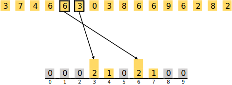
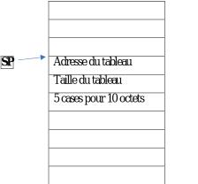

><p align="center">
  
</p>


# TP02: Manipulation de tableaux de caractères et algorithme avancés
- [Directives particulières](#directives)
- [Introduction](#Introduction)
- [Énoncé de travail](#enonce)
  - [Tri Comptage](#Comptage)
  - [Recherche dichotomique](#Dichotomique)
- [Sous-programmes à implémenter](#Fonction)
- [Remise](#Remise)
- [Barème](#bareme)

:alarm_clock: [Date de remise le dimanche 14 avril à 23h59](https://www.timeanddate.com/countdown/generic?iso=20240414T235959&p0=165&font=cursive)

# Directives particulières <a name="directives"></a>
* Le travail doit être effectué en équipe de 2 à 4 personnes.
* Respecter [guide de codage](https://ena.etsmtl.ca/pluginfile.php/1984632/mod_resource/content/1/TCH017%20-%20Normes%20de%20programmation.docx.pdf)
* Noms de variables et fonctions adéquats (concis, compréhensibles);
* Documentation du code
* Liens utiles:
  * [Tri Comptage](https://fr.wikipedia.org/wiki/Tri_comptage)
  * [Recherche dichotomique](https://fr.wikipedia.org/wiki/Recherche_dichotomique#:~:text=La%20recherche%20dichotomique%2C%20ou%20recherche,%C3%A9l%C3%A9ment%20dans%20un%20tableau%20tri%C3%A9.)

  
# 1. Introduction <a name="Introduction"></a>

<div align="justify">
L'époque actuelle est définie par un déluge de données, dans lequel le traitement et l'analyse de volumes massifs d'informations occupent une place centrale dans de nombreux domaines scientifiques et technologiques. Les algorithmes, au cœur de ces processus, jouent un rôle fondamental dans la détermination de la vitesse et de la précision de nos capacités à tirer des conclusions et à prendre des décisions. <br><br></div>

<div align="justify">
  
Ce projet est conçu pour introduire deux techniques algorithmiques essentielles : 
- **Le tri comptage :** une technique de tri adaptée aux ensembles de données distribués dans un intervalle spécifique.
- **La recherche dichotomique :** une méthode de recherche rapide et efficace pour les ensembles ordonnés.</div>

<div align="justify">
Au-delà de l'exploration de ces techniques algorithmiques, ce projet offre une occasion d'approfondir la compréhension de la manipulation de fonctions en langage assembleur PEP/8. Il permet d'examiner en détail le passage de paramètres par valeur et par adresse, deux principes fondamentaux pour une gestion efficace des données. La gestion de la pile et le retour des résultats de traitement, compétences clés pour la programmation de bas niveau et la compréhension approfondie des systèmes informatiques, seront également abordés.</div>

# 2. Énoncé de travail<a name="enonce"></a>

## 2.1. Tri Comptage (Counting Sort) <a name="Comptage"></a>

<div align="justify">
Le tri comptage, également connu sous le nom de tri par dénombrement, est présenté comme une méthode algorithmique spécifiquement adaptée au tri efficace d'ensembles de nombres entiers situés dans une plage définie. Cette technique se caractérise par une approche novatrice qui commence par la création d'un ``histogramme`` qui capture la fréquence de chaque valeur dans l'ensemble. Cet aperçu de la distribution est par la suite utilisé pour assembler de manière systématique l'ensemble trié. L'avantage principal du tri comptage est sa capacité à organiser les données sans avoir besoin de comparaisons directes entre les éléments, ce qui le rend particulièrement efficace pour les ensembles où les valeurs sont nombreuses mais confinées à une gamme restreinte.</div>


### 2.1.1. Exemple détaillé de Tri Comptage
<div align="justify">
Considérons un ensemble de données composé de nombres allant de 0 à 9, avec pour objectif de le trier selon la méthode du tri comptage.<br><br></div>

<p align="center">
  
</p>

#### 2.1.1.1. Algorithme de Tri Comptage – Phase 1 : Comptage des Éléments
<div align="justify">
La première étape consiste à préparer un tableau auxiliaire de longueur 10 (correspondant à l'intervalle de valeurs de 0 à 9), initialisé à zéro. Chaque indice de ce tableau est associé à une valeur potentielle de l'ensemble de données.</div>

<p align="center">
  
</p>

<div align="justify">
L'étape suivante consiste à parcourir l'ensemble de données, en incrémentant la valeur dans le tableau auxiliaire pour chaque élément rencontré. Ce procédé est répété pour chaque élément, aboutissant progressivement à un `histogramme` représentant la totalité des valeurs.</div>

<p align="center">
  
</p>

<div align="justify">
Pour un deuxième élément étant un 7, l'incrémentation s'effectue à l'indice 7 du tableau auxiliaire :</div>

<p align="center">
  
</p>

<div align="justify">
Les éléments 4 et 6 sont traités de manière similaire, avec une incrémentation des valeurs des indices 4 et 6 respectivement :</div>

<p align="center">
  
</p>

<div align="justify">
Les éléments suivants, 6 et 3, déjà comptabilisés auparavant, voient leurs indices correspondants dans le tableau auxiliaire augmenter de 1 à 2 :</div>

<p align="center">
  
</p>

<div align="justify">
Ce principe étant établi, après traitement de tous les éléments, le tableau auxiliaire présente finalement l'aspect suivant :</div>

<p align="center">
  
</p>

<div align="justify">
Cet `histogramme` offre une vue d'ensemble précise de la distribution des valeurs au sein de l'ensemble de données, indiquant le nombre exact de fois que chaque valeur est présente.<br><br></div>

Les occurrences dans l'ensemble à trier se présentent comme suit :
- 1 fois le 0,
- 0 fois le 1,
- 2 fois le 2,
- 3 fois le 3,
- 1 fois le 4,
- 0 fois le 5,
- 5 fois le 6,
- 1 fois le 7,
- 2 fois le 8, et
- 1 fois le 9.

Ces données seront exploitées dans la phase 2 pour réarranger le tableau à trier.

#### 2.1.1.2. Algorithme de Tri Comptage – Phase 2 : Réorganisation des Éléments
<div align="justify">
La seconde phase du tri comptage se sert de l'`histogramme` pour reconstituer l'ensemble trié. Cette étape consiste à parcourir le tableau auxiliaire et à insérer chaque valeur dans l'ensemble final autant de fois que son nombre d'occurrences indiqué dans l'`histogramme`, ce qui résulte en un ensemble de données méticuleusement ordonné.</div>

<p align="center">
  
</p>

<div align="justify">
Pour illustrer, le processus débute à l'indice 0 du tableau auxiliaire, où se trouve un 1. Par conséquent, le chiffre 0 est inscrit une fois dans l'ensemble à trier.</div>

<p align="center">
  
</p>

<div align="justify">
À l'indice 1 de l'`histogramme`, aucun élément n'est présent (valeur 0), indiquant qu'aucun 1 n'est ajouté à l'ensemble à trier.</div>

<p align="center">
  
</p>

<div align="justify">
L'indice 2 de l'`histogramme` affiche à nouveau un 1, menant à l'ajout d'un 2 dans l'ensemble à trier :</div>

<p align="center">
  
</p>

<div align="justify">
Arrivé à l'indice 3, qui compte un 3, cela conduit à insérer trois fois le chiffre 3 dans l'ensemble :</div>

<p align="center">
  
</p>

<div align="justify">
Le processus continue en ajoutant une fois le 4, cinq fois le 6, une fois le 7, deux fois le 8, et finalement une fois le 9 dans l'ensemble à trier :</div>

<p align="center">
  
</p>

<div align="justify">
Cette phase s'achève avec la formation d'un ensemble de données trié, signifiant la réussite de l'application de l'algorithme de tri comptage.</div>


### 2.1.2. Algorithme du Tri Comptage

<div align="justify">
L'exécution du tri comptage se déroule à travers une série d'étapes systématiques :
</div>

 <div align="justify">
   
1. **Détermination de la borne maximale et minimale :** 
 Cette étape consiste à identifier les valeurs extrêmes au sein de l'ensemble de données, ce qui permet de dimensionner adéquatement le tableau auxiliaire pour le comptage.

2. **Initialisation du tableau de comptage :**  
 Un tableau auxiliaire est préparé pour englober toutes les valeurs possibles comprises entre les bornes déterminées, initialisé avec des cellules à zéro.

3. **Complétion du tableau de comptage :** 
 L'ensemble de données est examiné, chaque élément observé augmente le compteur correspondant dans le tableau auxiliaire, formant ainsi l'`histogramme` des occurrences.
  
4. **Assemblage du tableau trié :** 
 Le processus se conclut par la reconstruction de l'ensemble de données en ordre croissant, basée sur les données de l'`histogramme`, achevant le tri.</div>

<div align="justify">
Une implémentation en pseudo-code du tri comptage est présentée ci-après :
</div>

<p align="center">
    
</p>


## 2.2. Recherche dichotomique <a name="Dichotomique"></a>

<div align="justify">
La recherche dichotomique constitue un progrès notable dans le champ des algorithmes de recherche, avec pour but de détecter rapidement la présence et la position d'un élément spécifique dans un ensemble trié. Cette technique est comparable à la façon dont on cherche un nom dans un annuaire téléphonique, où l'objectif est de localiser des informations précises associées à un identifiant déterminé. Par sa méthode efficace de division successive de l'espace de recherche, la recherche dichotomique se distingue par son aptitude à parcourir des ensembles de données organisées séquentiellement, offrant une performance supérieure en termes de vitesse et de précision par rapport aux méthodes traditionnelles.
</div>


### 2.2.1. Approche Naïve vs Approche Dichotomique

#### 2.2.1.1. Recherche Naïve

<div align="justify">
L'approche naïve, qui consiste à parcourir chaque élément d'un tableau de manière séquentielle pour identifier une valeur spécifique, est simple d'intuition mais se montre peu efficace pour les vastes ensembles de données. Cette technique engage un examen linéaire du tableau, effectuant une comparaison de chaque élément avec la valeur cible jusqu'à détecter une correspondance ou établir son absence. Bien que cette méthode soit facile à comprendre, elle est caractérisée par une complexité linéaire, faisant ainsi du temps de recherche un facteur directement proportionnel à la dimension de l'ensemble.
</div>

```c++
int Rech_nai(int tab[], int taille, int val) {
    for (int i = 0; i < taille; i++) 
        if (tab[i] == val) 
            return i;
    return -1;
}
```

#### 2.2.1.2. Recherche dichotomique

<div align="justify">
Employant une tactique de division par moitié, la recherche dichotomique initie son processus par l'examen de l'élément au milieu du tableau. Si cet élément central diffère de l'objectif, la recherche continue dans la section du tableau adéquate, déterminée par la comparaison de cet élément avec la cible. Cette méthode itérative, réduisant de moitié l'espace de recherche à chaque étape, facilite efficacement la détection de la valeur ciblée ou confirme sa non-présence, tirant avantage de l'ordonnancement préétabli des données pour accélérer le processus de recherche.
</div>

<p align="center">
    
</p>


### 2.2.2. Vérification de l'Applicabilité de la Recherche dichotomique

<div align="justify">La recherche dichotomique est appréciée pour sa capacité à identifier rapidement des éléments dans des ensembles de données structurés. Afin d'assurer cette efficience, il est impératif de valider deux critères fondamentaux : la garantie de terminaison de l'algorithme et la fiabilité des résultats.</div>
<div align="justify">
  
1. **Terminaison de la Boucle** : 
La finitude de l'algorithme repose sur le concept de "variant de boucle", qui prévoit une réduction constante et mesurable de l'espace de recherche à chaque cycle. Cette approche, maintenant le critère de décroissance toujours positif ou nul, confirme que l'algorithme atteindra une résolution en un nombre limité de pas, éliminant le risque de bouclage perpétuel.

2. **Exactitude des Résultats** : 
L'exactitude est essentielle pour vérifier que l'indice retourné par l'algorithme correspond effectivement à l'élément ciblé, ou signale de manière appropriée son absence. La précision des retours valide la confiance en la recherche dichotomique comme méthode d'investigation au sein d'ensembles ordonnés.<br><br></div>

<div align="justify">L'adoption d'un cadre de vérification strict assure la compétence de la recherche dichotomique à produire des conclusions fiables et justes. Cette technique utilise une stratégie de fractionnement efficace, réduisant exponentiellement l'espace de recherche à chaque étape, ce qui affûte rapidement le champ d'investigation jusqu'à la localisation exacte de l'élément recherché ou la détermination de son absence.<br><br></div>

<div align="justify">Pour exposer le mécanisme assurant la terminaison et la fidélité des résultats :

1. Le milieu est déterminé par `milieu = (gauche + droite) // 2`, veillant à ce que `gauche <= milieu <= droite`.
2. Trois cas se présentent alors :
   - Si `tab[milieu] = val`, la cible est trouvée et la quête s'achève.
   - Si `tab[milieu] > val`, l'exploration se dirige vers la section inférieure, réajustant la limite `droite` à `milieu - 1`, diminuant ainsi la zone de recherche.
   - Si `tab[milieu] < val`, le processus se poursuit dans la moitié supérieure, en déplaçant la frontière `gauche` à `milieu + 1`.<br><br></div>

<div align="justify">Ces démarches assurent une diminution systématique de l'espace de recherche, garantissant ainsi la conclusion de l'algorithme tout en préservant une exactitude optimale des déductions.</div>


### 2.2.3. Exemple détaillé de la recherche dichotomique

<div align="justify">
Prenons l'exemple de la quête du chiffre 56 au sein d'un tableau ordonné pour illustrer la recherche dichotomique. Cette méthode initie son processus en évaluant l'élément au centre du tableau. Si la valeur cible excède cet élément central, la recherche se concentre désormais sur la demi-section supérieure du tableau, et inversement. Ce processus se répète, affinant de façon progressive l'espace de recherche jusqu'à la détection de la valeur souhaitée ou la détermination de son absence.
</div>

<p align="center">
  
</p>

<div align="justify">
La première action consiste à examiner l'élément médian, qui est 45. Étant donné que la valeur recherchée est plus grande que 45, l'attention se porte sur la partie droite du tableau, réduisant l'espace de recherche à un sous-tableau comprenant les valeurs 48, 56, 60, 79, et 86.</div>

<p align="center">
  
</p>

<div align="justify">
Pour la deuxième étape, l'élément central du sous-tableau (48, 56, 60, 79, 86) est 60. Comme 60 est supérieur au chiffre recherché, la recherche se dirige vers la moitié gauche du sous-tableau, constituée de 48 et 56.</div>

<p align="center">
  
</p>

<div align="justify">
Dans la phase finale, il ne reste plus que les valeurs 48 et 56. L'élément au milieu étant 48, inférieur à la valeur recherchée, la logique veut que la valeur suivante, 56, soit celle recherchée. L'algorithme conclut ici son exécution.</div>

<p align="center">
  
</p>

<div align="justify">
Cet exemple souligne l'efficacité intrinsèque de la recherche dichotomique, qui permet de trouver rapidement un élément au sein d'un tableau ordonné en réduisant méthodiquement l'espace de recherche, démontrant ainsi la force de la stratégie de division pour régner caractéristique des algorithmes de recherche.
</div>


# 3. Sous-programmes à implémenter <a name="Fonction"></a>

## 3.1. Préparation de la pile :
<div align="justify">
Un espace sera réservé dans la pile pour trois tableaux de caractères ASCII, nécessitant respectivement 10, 20 et 30 octets pour leur stockage.</div>
  
```asm
a_tab1:  .ASCII  "Allo!"           ; Tableau 1 : [65 108 108 111 33]
a_tab2:  .ASCII  "Message!!!"      ; Tableau 2 : [77 101 115 115 97 103 101 33 33 33]
a_tab3:  .ASCII  "Bonjour TCH017!" ; Tableau 3 : [66 111 110 106 111 117 114 32 84 67 72 48 49 55 33]
```

## 3.2. Chargement des tableaux :
<div align="justify">
Pour gérer les emplacements et les tailles des tableaux dans la pile, les constantes `a_tai1, a_tai2, a_tai3, a_ad_t1, a_ad_t2, et a_ad_t3` sont établies. Ces définitions facilitent la manipulation des adresses et des dimensions des tableaux de façon dynamique pendant leur chargement.</div>

```asm
a_tai1:  .EQUATE 10     ; Taille en octets du tableau 1.
a_tai2:  .EQUATE 20     ; Taille en octets du tableau 2.
a_tai3:  .EQUATE 30     ; Taille en octets du tableau 3.
a_tai4:  .EQUATE 256    ; Taille en octets de l'histogramme.

a_ad_t1: .EQUATE 0      ; Adresse du premier élément du tableau 1 dans la pile.
a_ad_t2: .EQUATE 10     ; Adresse du premier élément du tableau 2 dans la pile.
a_ad_t3: .EQUATE ?      ; Adresse du premier élément du tableau 3 dans la pile.
a_ad_his:.EQUATE ?      ; Adresse du premier élément de l'histogramme dans la pile.
```

<div align="justify">
Le chargement des tableaux dans la pile exige la réservation de l'espace nécessaire pour chaque tableau. Cela se fait en ajustant le pointeur de pile selon la taille totale du tableau, puis en enregistrant l'adresse de début et la taille du tableau au-dessus de leur position respective dans la pile.</div>   

**Exemple de chargement pour le tableau 1 :**
<div align="justify">Ajuster le pointeur de pile de 10 octets pour le tableau 1, et noter l'adresse de départ ainsi que la taille du tableau.<br><br></div>

<p align="center">
  
</p>

<div align="justify">Une fois cette opération effectuée pour un tableau, les autres tableaux seront ajoutés successivement de la même manière.</div>     

<div align="justify">
Après le chargement de tous les tableaux, ils seront disposés les uns sur les autres dans la pile, comme le montre l'image suivante qui illustre la configuration de la pile une fois les tableaux chargés.</div>

<p align="center">
  
</p>


## 3.3. Sous-Tâches de Base :
<div align="justify">
Il est recommandé de commencer par les sous-tâches simples qui permettent la lecture, le chargement des tableaux dans la pile, ainsi que leur manipulation. </div>
 
    
1. **A_LECTUR**
   
    <div align="justify">Cette fonction charge un tableau de caractères ASCII, les convertit en valeurs décimales, et place les éléments convertis dans l'emplacement approprié dans la pile.</div>
     
   **Paramètres :**
   - `a_tab`  : Adresse du début du tableau ASCII en mémoire.
   - `a_tai`  : Taille du tableau, indiquant le nombre de caractères ASCII à convertir.
   - `a_ad_t` : Adresse dans la pile où les éléments convertis en décimale doivent être placés.
   
   **Retour :**
   - <div align="justify">Aucune valeur retournée directement. Les éléments convertis en décimale sont positionnés à l'adresse spécifiée dans la pile.</div>
---

2. **A_AFFICH**
   
    <div align="justify">Fonction destinée à afficher le contenu d'un tableau en format décimal.</div>
     
   **Paramètres :**
   - `a_ad_t`: Adresse dans la pile du premier élément du tableau à afficher.
   - `a_tai` : Taille du tableau, indiquant le nombre d'éléments à afficher.
   
   **Retour :**
   - <div align="justify">Aucune valeur retournée. Les éléments du tableau sont affichés en format décimal. </div>

---

3. **A_MINIM** 
   
    <div align="justify">Fonction dédiée à la recherche de la valeur minimale au sein d'un tableau.</div>
     
   **Paramètres :**
   - `a_ad_t`: Adresse dans la pile du premier élément du tableau à examiner.
   - `a_tai` : Taille du tableau, déterminant le nombre d'éléments à analyser.
   
   **Retour :**
   - `a_min` : Contient la valeur minimale identifiée dans le tableau.

---

4. **A_MAXIM** 
   
    <div align="justify">Fonction pour identifier la valeur maximale dans un tableau.</div>
     
   **Paramètres :**
   - `a_ad_t`: Adresse dans la pile du premier élément du tableau à examiner.
   - `a_tai` : Taille du tableau, spécifiant le nombre d'éléments à considérer.
   
   **Retour :**
   - `a_max` : Enregistre la valeur maximale trouvée dans le tableau.
   
---
 
5. **A_HISTO** 
   
   <div align="justify">Fonction permettant de calculer la fréquence des éléments d'un tableau et de réorganiser ces derniers à l'aide d'un `histogramme`.</div>
     
   **Paramètres :**
   - `a_ad_t`  : Adresse dans la pile du premier élément du tableau à analyser.
   - `a_tai`   : Taille du tableau, précisant le nombre d'éléments à évaluer.
   - `a_ad_his`: Adresse dans la pile où débutera l'histogramme, recensant la fréquence de chaque élément du tableau.
   
   **Retour :**
    - <div align="justify">Aucune valeur retournée directement. Le tableau est restructuré selon l'`histogramme` et les éléments sont repositionnés à l'adresse indiquée dans la pile.</div>
     

## 3.4. Procédures de Tri et Recherche :
<div align="justify">Une fois les sous-tâches de base réalisées, il est nécessaire d'implémenter les procédures de tri et de recherche suivantes :</div>

1. **A_TRICOM** 

   <div align="justify">Procédure dédiée à l'exécution du tri par comptage, une technique adaptée au tri efficace de tableaux.</div>
   
   **Paramètres :**
   - `a_ad_t`   : Adresse dans la pile du premier élément du tableau à trier.
   - `a_tai`    : Taille du tableau, définissant le nombre d'éléments à ordonner.
   - `a_ad_his` : Adresse dans la pile destinée à l'histogramme, recensant la fréquence de chaque élément du tableau.
  
   **Retour :**
   - <div align="justify">Aucune valeur n'est retournée directement. Les éléments du tableau sont ordonnés et actualisés à leur position respective sur la pile.</div>

---

2. **A_RECHDI** 
   
    <div align="justify">Procédure conçue pour réaliser une recherche dichotomique, visant à identifier une valeur spécifique au sein d'un tableau déjà trié. Cette méthode optimise la recherche en divisant l'intervalle de recherche par deux à chaque itération, diminuant ainsi le nombre de comparaisons nécessaires pour repérer l'élément ciblé.</div>
     
   **Paramètres :**
   - `a_ad_t`  : Adresse dans la pile du premier élément du tableau trié.
   - `a_tai`   : Taille du tableau, précisant le nombre d'éléments inclus dans la recherche.
   - `a_cible` : La valeur recherchée dans le tableau.
   
   **Retour :**
   - `a_indice` : Indique la position de l'élément recherché dans le tableau, si celui-ci est trouvé.

## 3.5. Resultats attendus :

### 3.5.1. Lecture et tri du tableau 1 :

<div align="justify">L'opération initiale consiste à lire les données du tableau 1 et à les placer dans la pile selon les emplacements définis. Cette démarche prépare les données pour les traitements à venir. Après cette lecture, les valeurs du tableau sont stockées dans la pile tel qu'anticipé. Voici un aperçu de l'état de la mémoire à ce moment.</div>

<p align="center">
  
</p>

<div align="justify">L'étape suivante est la création de l'`histogramme`, qui consiste à comptabiliser la fréquence de chaque nombre dans le tableau et à enregistrer ces compteurs dans un tableau d'`histogramme` préalablement défini. Un aperçu de l'état de la mémoire à cette phase est présenté ci-dessous.</div>

<p align="center">
  
</p>

<div align="justify">Le tri du tableau s'effectue ensuite par la méthode du tri par comptage, exploitant l'`histogramme` pour ordonner les éléments de manière croissante. Un aperçu de l'état de la mémoire suite à cette opération est donné ci-après.</div>

<p align="center">
  
</p>

<div align="justify">Il est enfin nécessaire de montrer le contenu du tableau sur la console, avant et après le tri, pour valider visuellement l'efficacité de cette méthode. L'image suivante illustre à quoi devrait ressembler l'affichage final sur la console.</div>
<p align="center">
  
</p>


### 3.5.2. Lecture des tableaux 1 et 2 et tri du tableau 2:
<div align="justify">La démarche commence par la lecture des données des tableaux 1 et 2, stockées ensuite dans la pile aux emplacements préétablis. Cette action prépare les données pour les étapes suivantes. Un aperçu de l'état de la mémoire après cette opération est disponible ci-dessous.</div>

<p align="center">
  
</p>

<div align="justify">La construction de l'`histogramme` pour le tableau 2 s'ensuit, avec le comptage des occurrences de chaque élément et leur enregistrement dans un tableau d'`histogramme`. Un aperçu de la mémoire à ce moment est présenté ensuite.</div>

<p align="center">
  
</p>

<div align="justify">Le tri du tableau 2 est réalisé en dernier, en utilisant la technique du tri par comptage qui se base sur l'`histogramme`. Un aperçu de la mémoire suite à cette opération est montré ci-dessous.</div>

<p align="center">
  
</p>

<div align="justify">Pour conclure, il est indispensable d'afficher le contenu du tableau 2 sur la console, avant et après le tri, pour confirmer l'efficacité du processus. L'image suivante montre ce à quoi l'affichage final devrait ressembler sur la console.</div>
<p align="center">
  
</p>


### 3.5.3. Lecture des tableaux 1, 2 et 3 et tri du tableau 3:
<div align="justify">La procédure initie par la lecture des données des tableaux 1, 2, et 3, suivie de leur stockage dans la pile aux lieux prédéfinis. Cette phase prépare les données pour les traitements futurs. Un aperçu de l'état de la mémoire après ces lectures est donné ci-après.</div>

<p align="center">
  
</p>

<div align="justify">La création de l'`histogramme` pour le tableau 3 suit, nécessitant le comptage des fréquences de chaque élément et leur stockage dans un tableau d'`histogramme`. Un aperçu de la mémoire à ce stade est illustré ci-dessous.</div>

<p align="center">
  
</p>

<div align="justify">Le tri du tableau 3 constitue l'étape finale, avec l'application du tri par comptage basé sur l'`histogramme`. Un aperçu de la mémoire après cette opération est présenté ci-dessous.</div>

<p align="center">
  
</p>

<div align="justify">En dernier lieu, il est essentiel d'exposer le contenu du tableau 3 sur la console, avant et après le tri, pour attester de l'efficacité de la méthode. L'image suivante propose un exemple de l'affichage final attendu sur la console.</div>
<p align="center">
  
</p>


### 3.5.4. Recherche dichotomique dans le tableau trié :

#### 3.5.4.1. Cas 1: Recherche d'une valeur inexistante dans le tableau 1
<div align="justify">Ce scénario expose la recherche infructueuse d'une valeur absente du tableau 1.</div>
<p align="center">
  
</p>

#### 3.5.4.2. Cas 2: Recherche d'une valeur présente dans le tableau 1
<div align="justify">Ce cas détaille la recherche réussie d'une valeur existante dans le tableau 1.</div>

<p align="center">
  
</p>

#### 3.5.4.3. Cas 3: Recherche d'une valeur inexistante dans le tableau 2
<div align="justify">Ce scénario montre la recherche d'une valeur non présente dans le tableau 2.</div>
<p align="center">
  
</p>

#### 3.5.4.4. Cas 4: Recherche d'une valeur présente dans le tableau 2
<div align="justify">Ce cas illustre la recherche fructueuse d'une valeur existante dans le tableau 2.</div>

<p align="center">
  
</p>

#### 3.5.4.5. Cas 5: Recherche d'une valeur inexistante dans le tableau 3
<div align="justify">Ce scénario dépeint la tentative de localisation d'une valeur absente du tableau 3.</div>
<p align="center">
  
</p>

#### 3.5.4.6. Cas 6: Recherche d'une valeur présente dans le tableau 3
<div align="justify">Ce cas présente la recherche réussie d'une valeur existante dans le tableau 3.</div>

<p align="center">
  
</p>

#### 3.5.4.7. Cas 7: Recherche d'une valeur inexistante dans le tableau 1 avec saisie multiple 
<div align="justify">Ce scénario met en lumière la recherche d'une valeur inexistante dans le tableau 1, suivie de multiples tentatives erronées de sélection du tableau par l'utilisateur. Il illustre la capacité du programme à gérer les erreurs de saisie, guidant l'utilisateur vers une saisie correcte avant de procéder à la recherche. L'image ci-dessous représente le résultat de cette démarche, soulignant l'absence de la valeur recherchée même après la correction des sélections de l'utilisateur.</div>

<p align="center">
  
</p>

#### 3.5.4.8. Cas 8: Recherche d'une valeur présente dans le tableau 1 avec saisie multiple
<div align="justify">Ce cas illustre la recherche réussie d'une valeur présente dans le tableau 1, effectuée après plusieurs sélections incorrectes du tableau par l'utilisateur. Cette situation démontre l'efficacité du système à rediriger l'utilisateur depuis des erreurs initiales vers la réalisation d'une recherche fructueuse. L'image suivante affiche le résultat de cette opération, confirmant la présence de la valeur recherchée dans le tableau 1 suite à la correction des entrées de l'utilisateur.</div>

<p align="center">
  
</p>

## 3.6. Validation :
<div align="justify">Afin de s'assurer de la précision des opérations réalisées dans ce TP, divers outils de visualisation disponibles dans l'environnement de développement PEP/8 seront employés.
  
- **Vue Memory Dump** : Cet outil s'avère crucial pour l'examen direct du contenu de la mémoire, permettant de confirmer que les valeurs sont correctement stockées dans les tableaux. Il facilite ainsi la validation manuelle de l'exactitude des données insérées.

- **Fenêtre Output** : Cette fenêtre est utilisée pour observer les résultats définitifs des tableaux après leur traitement. Elle fournit un aperçu précis des changements effectués sur les données, à la suite des processus de tri et de recherche.</div>


# 4. Remise <a name="Remise"></a>
<div align="justify">Ce projet est structuré autour de trois phases de remise réparties sur trois semaines, avec un focus sur un groupe spécifique de fonctions à développer et à tester pour garantir leur bon fonctionnement.</div>

  - Semaine 1: TP02_H24_Semaine_01.pep
  - Semaine 2: TP02_H24_Semaine_02.pep
  - Semaine 3: TP02_H24_Semaine_03.pep
  
<div align="justify">Après avoir réussi l'implémentation et les tests de toutes les fonctions, il est essentiel de sauvegarder soigneusement votre projet. Les fichiers de programme doivent être compilés dans une archive zip nommée selon le format suivant : equipe_xx.zip, où xx désigne le numéro de votre équipe.<br><br></div>

Bon travaille! :blush:


# 5. Barème /100 <a name="bareme"></a>
|**Nom des fonctions**|**Nombre de points attribuer**|
| :- | :- |
|A_LECTUR | 15 |
|A_AFFICH | 10 |
|A_MINIM | 5 |
|A_MAXIM | 5 |
|A_HISTO | 25 |
|A_TRICOM | 20 |
|A_RECHDI | 20 |
