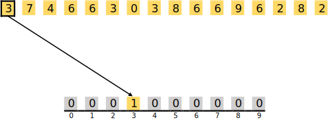
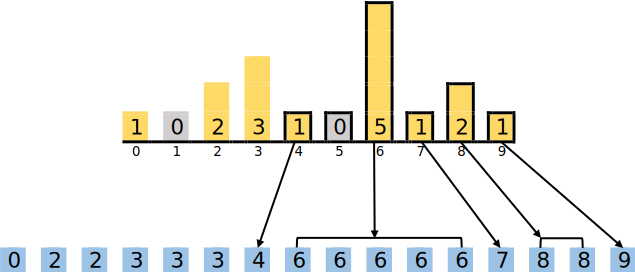

><p align="center">
  
</p>


# PR02: Manipulation de tableaux de caractères et algorithme avancés
- [Directives particulières](#directives)
- [Introduction](#Introduction)
- [Énoncé de travail](#enonce)
  - [Tri Comptage](#Comptage)
  - [Recherche Dichotomique](#Dichotomique)
- [Sous-programmes à implémenter](#Fonction)
- [Remise](#Remise)
- [Barème](#bareme)

:alarm_clock: [Date de remise le dimanche 14 avril à 23h59](https://www.timeanddate.com/countdown/generic?iso=20240414T235959&p0=165&font=cursive)

# Directives particulières <a name="directives"></a>
* Le travail doit être effectué en équipe de 2 à 4 personnes.
* Respecter [guide de codage](https://ena.etsmtl.ca/pluginfile.php/1984632/mod_resource/content/1/TCH017%20-%20Normes%20de%20programmation.docx.pdf)
* Noms de variables et fonctions adéquats (concis, compréhensibles);
* Documentation du code
* Liens utiles:
  * [Tri Comptage](https://fr.wikipedia.org/wiki/Tri_comptage)
  * [Recherche dichotomique](https://fr.wikipedia.org/wiki/Recherche_dichotomique#:~:text=La%20recherche%20dichotomique%2C%20ou%20recherche,%C3%A9l%C3%A9ment%20dans%20un%20tableau%20tri%C3%A9.)

  
# 1. Introduction <a name="Introduction"></a>

<div align="justify">
Nous vivons dans une époque définie par le déluge de données, où le traitement et l'analyse de volumes massifs d'informations jouent un rôle pivot dans de nombreux domaines de la science et de la technologie. Au cœur de ces processus se trouvent les algorithmes, dont l'efficacité détermine la rapidité et la précision avec lesquelles nous pouvons tirer des conclusions et prendre des décisions. Ce projet vise à vous familiariser avec deux techniques algorithmiques fondamentales: le tri comptage et la recherche dichotomique. Ces techniques ne sont pas seulement vitales pour le traitement des données mais constituent également une porte d'entrée vers la compréhension des principes opérationnels au cœur de l'informatique.<br><br></div>

<div align="justify">
Le tri comptage se distingue en tant que méthode de tri non comparatif, optimisée pour organiser des nombres entiers au sein de plages de valeurs définies. Sa spécificité réside dans sa capacité à classifier les données sans nécessiter de comparaisons directes entre elles, ce qui le rend particulièrement efficace pour trier de grands ensembles de données où les valeurs se trouvent à proximité les unes des autres. D'autre part, la recherche dichotomique adopte une stratégie de "division et conquête", permettant de localiser avec rapidité un élément spécifique dans un tableau trié. Cette méthode s'avère significativement plus rapide que la recherche séquentielle, offrant une efficience accrue pour les opérations de recherche dans de grandes bases de données. À travers ce projet, nous explorerons en profondeur ces techniques pour révéler non seulement leur fonctionnement interne et leurs avantages mais également leurs limites.<br><br></div>

<div align="justify">
En parallèle, nous plongerons dans le monde de la programmation en assembleur PEP/8, un langage de bas niveau qui dévoile les mécanismes sous-jacents des opérations informatiques. Ce cadre vous apprendra à manipuler des tableaux un élément fondamental dans la gestion des structures de données avec une attention particulière portée au tri comptage et à la recherche dichotomique. Vous aborderez également la gestion de la mémoire, une composante crucial de la programmation en assembleur, qui vous éclairera sur la façon dont la mémoire est allouée, employée, et libérée dans le cadre d'un programme. L'utilisation de la pile, essentielle pour la gestion des appels de fonction et la déclaration des variables locales, ainsi que les techniques pour définir et appeler des fonctions en langage assembleur, seront examinées en détail.<br><br></div>

<div align="justify">
Ce projet vous offre également l'occasion d'appréhender les subtilités du passage de paramètres par valeur et par adresse deux concepts clés pour une gestion optimale des données en programmation. Cette expérience enrichissante vous munira des compétences et connaissances nécessaires pour naviguer à travers des problématiques informatiques plus sophistiquées, élargissant ainsi votre horizon et approfondissant votre compréhension des processus internes qui animent les ordinateurs.<br><br></div>

<div align="justify">
Au final, ce projet est conçu pour tisser ensemble la théorie et la pratique, dans le but d'affermir votre compréhension des principes essentiels de l'informatique tout en affûtant vos compétences en programmation en assembleur PEP/8. Il vous équipera pour relever avec confiance des défis informatiques variés, armé d'une perspective éclairée et d'une appréciation profonde pour l'essence même de la technologie informatique.</div>

# 2. Énoncé de travail<a name="enonce"></a>

## 2.1. Tri Comptage (Counting Sort) <a name="Comptage"></a>

<div align="justify">
Le tri comptage, également connu sous le nom de tri par dénombrement, est une technique algorithmique conçue spécifiquement pour trier des ensembles de nombres entiers situés dans un intervalle précis. Cette méthode se distingue par son approche unique : elle établit d'abord un "histogramme" des données, identifiant le nombre d'occurrences de chaque valeur, puis elle utilise cette distribution pour reconstruire l'ensemble trié. L'avantage principal du tri comptage réside dans sa capacité à trier les données sans avoir besoin de comparer les éléments entre eux, ce qui le rend particulièrement efficace pour les ensembles de données où les valeurs sont nombreuses mais étroitement groupées.</div>

### 2.1.1. Exemple Détaillé de Tri Comptage
<div align="justify">
Imaginons un ensemble de données contenant des nombres allant de 0 à 9. Notre objectif est de trier cet ensemble selon le principe du tri comptage.<br><br></div>

Le tableau suivant doit être trié :
<p align="center">
  
</p>

#### 2.1.1.1. Algorithme de Tri Comptage – Phase 1 : Comptage des Éléments
<div align="justify">
La première étape consiste à préparer un tableau auxiliaire, ici de longueur 10 (correspondant à notre intervalle de valeurs de 0 à 9), et à l'initialiser avec des zéros. Chaque indice de ce tableau représente une valeur possible dans notre ensemble de données.</div>

<p align="center">
  
</p>

<div align="justify">
Nous parcourons ensuite notre ensemble de données, en augmentant la valeur dans notre tableau auxiliaire à l'indice correspondant à chaque élément rencontré. Ce processus est répété pour chaque élément de l'ensemble de données, construisant progressivement un histogramme complet des valeurs.</div>

<p align="center">
  
</p>

<div align="justify">
Le deuxième élément est un 7. Nous incrémentons le champ à la position 7 dans le tableau auxiliaire :</div>

<p align="center">
  
</p>

<div align="justify">
Les éléments 4 et 6 suivent – ainsi, nous augmentons les valeurs aux positions 4 et 6 de un chacun :</div>

<p align="center">
  
</p>

<div align="justify">
Les deux éléments suivants – le 6 et le 3 – sont deux éléments qui sont déjà apparus auparavant. En conséquence, les champs correspondants dans le tableau auxiliaire sont augmentés de 1 à 2 :</div>

<p align="center">
  
</p>

<div align="justify">
Le principe devrait être clair maintenant. Après avoir également augmenté les valeurs du tableau auxiliaire pour les éléments restants, le tableau auxiliaire ressemble finalement à ceci :</div>

<p align="center">
  
</p>

<div align="justify">
Cet histogramme nous fournit une représentation claire de la distribution des valeurs dans notre ensemble de données, indiquant exactement combien de fois chaque valeur apparaît.<br><br></div>

Les éléments à trier contiennent :
- 1 fois le 0,
- 0 fois le 1,
- 2 fois le 2,
- 3 fois le 3,
- 1 fois le 4,
- 0 fois le 5,
- 5 fois le 6,
- 1 fois le 7,
- 2 fois le 8 et
- 1 fois le 9.

Nous utiliserons ces informations dans la phase 2 pour réorganiser le tableau à trier.


#### 2.1.1.2. Algorithme de Tri Comptage – Phase 2 : Réorganisation des Éléments
<div align="justify">
La seconde phase du tri comptage utilise l'histogramme pour reconstruire l'ensemble trié. En parcourant le tableau auxiliaire, nous plaçons chaque valeur dans l'ensemble de données final autant de fois que l'indique son comptage dans l'histogramme, produisant ainsi un ensemble de données parfaitement ordonné.</div>

<p align="center">
  
</p>

<div align="justify">
Dans l'exemple, nous commençons à la position 0 dans le tableau auxiliaire. Ce champ contient un 1, donc nous écrivons le 0 exactement une fois dans le tableau à trier.</div>

<p align="center">
  
</p>

<div align="justify">
À la position 1 dans l'histogramme, il y a un 0, ce qui signifie que nous sautons ce champ – aucun 1 n'est écrit dans le tableau à trier.</div>

<p align="center">
  
</p>

<div align="justify">
La position 2 de l'histogramme contient à nouveau un 1, donc nous écrivons un 2 dans le tableau à trier :</div>

<p align="center">
  
</p>

<div align="justify">
Nous arrivons à la position 3, qui contient un 3 ; donc nous écrivons trois fois un 3 dans le tableau :</div>

<p align="center">
  
</p>

<div align="justify">
Et ainsi de suite. Nous écrivons une fois le 4, cinq fois le 6, une fois le 7, deux fois le 8 et enfin une fois le 9 dans le tableau à trier :</div>

<p align="center">
  
</p>

<div align="justify">
À l'issue de cette phase, nous obtenons un ensemble de données trié, marquant la conclusion réussie de l'algorithme de tri comptage.</div>


### 2.1.2. Algorithme du Tri Comptage

<div align="justify">
L'application du tri comptage suit une séquence d'étapes méthodiques :
</div>

 <div align="justify">
   
1. **Détermination de la borne maximale et minimale :** 
 Identifier les valeurs extrêmes dans l'ensemble de données permet de dimensionner correctement le tableau auxiliaire utilisé pour le comptage.

2. **Initialisation du tableau de comptage :**  
  Un tableau auxiliaire est initialisé pour couvrir toutes les valeurs possibles entre les bornes identifiées, avec chaque cellule démarrant à zéro.

3. **Remplissage du tableau de comptage :** 
  Chaque élément de l'ensemble de données est parcouru, et le comptage correspondant dans le tableau auxiliaire est incrémenté, construisant l'histogramme des valeurs.
  
4. **Reconstruction du tableau trié :** 
  Enfin, l'ensemble de données est reconstitué en ordre croissant en se basant sur les informations contenues dans l'histogramme, complétant ainsi le processus de tri.</div>

<div align="justify">
Voici une implémentation en pseudo-code du tri comptage:
</div>

<p align="center">
    
</p>


## 2.2. Recherche Dichotomique <a name="Dichotomique"></a>

<div align="justify">
La recherche dichotomique représente une avancée significative dans le domaine des algorithmes de recherche, visant à identifier rapidement la présence et l'emplacement d'une donnée spécifique au sein d'un ensemble ordonné. Cette méthode s'apparente à la recherche d'une entrée dans un annuaire téléphonique, où l'objectif est de trouver des informations précises liées à un identifiant spécifique. Grâce à sa stratégie efficace de division de l'espace de recherche, la recherche dichotomique excelle dans la navigation à travers des données structurées de manière séquentielle, surpassant les approches conventionnelles par sa rapidité et sa précision.
</div>

### 2.2.1. Approche Naïve vs Approche Dichotomique

#### 2.2.1.1. Recherche Naïve

<div align="justify">
L'approche naïve, consistant à examiner séquentiellement chaque élément d'un tableau pour trouver une valeur cible, est intuitive mais inefficace pour les grands ensembles de données. Cette méthode implique un parcours linéaire du tableau, comparant chaque élément à la valeur recherchée jusqu'à trouver une correspondance ou confirmer son absence. La simplicité de cette technique s'accompagne d'une complexité linéaire, rendant le temps de recherche proportionnel à la taille de l'ensemble.
</div>

```c++
int Rech_nai(int tab[], int taille, int val) {
    for (int i = 0; i < taille; i++) 
        if (tab[i] == val) 
            return i;
    return -1;
}
```

<div align="justify">
Malgré sa simplicité, l'approche naïve ne capitalise pas sur l'ordre des éléments au sein du tableau, chaque recherche étant indépendante de la précédente sans tirer de leçons de l'ordre établi des données.
</div>

#### 2.2.1.2. Recherche Dichotomique

<div align="justify">
La recherche dichotomique adopte une stratégie de division efficace, commençant par l'élément central du tableau. Si cet élément n'est pas la cible, la recherche se poursuit dans la moitié pertinente du tableau, en fonction de la comparaison avec la valeur cible. Ce processus se répète, réduisant l'espace de recherche de moitié à chaque itération, ce qui permet une localisation rapide de la valeur recherchée ou la confirmation de son absence, exploitant ainsi l'ordre des éléments pour optimiser la recherche.
</div>

<p align="center">
    
</p>

### 2.2.2. Vérification de la Fiabilité de la Recherche Dichotomique

<div align="justify">La recherche dichotomique est reconnue pour son efficacité dans la localisation rapide d'éléments au sein de données structurées. Pour garantir cette efficacité, deux aspects cruciaux doivent être systématiquement vérifiés : la terminaison de l'algorithme et la précision des résultats obtenus.</div>
<div align="justify">
  
1. **Terminaison de la Boucle** : 
La terminaison de l'algorithme est assurée par l'application d'un "variant de boucle", un principe qui impose une décroissance stricte et systématique de l'espace de recherche à chaque itération. Cette mesure, restant toujours positive ou nulle, garantit que l'algorithme parvienne à une conclusion en un nombre fini d'étapes, évitant ainsi tout risque de boucle infinie.

2. **Précision de la Réponse** : 
Quant à la précision, elle est primordiale pour confirmer que l'indice renvoyé par l'algorithme correspond bien à l'élément recherché, ou indique correctement son absence. Cette exactitude des résultats assure la fiabilité de la recherche dichotomique comme méthode de recherche dans des ensembles de données ordonnés.<br><br></div>

<div align="justify">La mise en œuvre d'un système de vérification rigoureux confirme la capacité de la recherche dichotomique à fournir des résultats fiables et précis. Cette méthode exploite une stratégie de recherche optimisée, divisant de manière exponentielle l'espace de recherche à chaque étape, ce qui permet d'affiner rapidement la zone de recherche jusqu'à localiser précisément l'élément désiré ou conclure à son absence.<br><br></div>

<div align="justify">Pour illustrer le processus garantissant la terminaison et la précision :

1. Le point médian est calculé par `milieu = (gauche + droite) // 2`, assurant que `gauche <= milieu <= droite`.
2. Trois scénarios sont alors envisageables :
   - Si `tab[milieu] = val`, l'élément est trouvé et la recherche se termine.
   - Si `tab[milieu] > val`, la recherche se poursuit dans la moitié inférieure, déplaçant la borne `droite` à `milieu - 1`, réduisant ainsi l'espace de recherche.
   - Si `tab[milieu] < val`, la recherche continue dans la moitié supérieure, ajustant la borne `gauche` à `milieu + 1`.<br><br></div>

<div align="justify">Ces étapes garantissent la réduction continue de l'espace de recherche, assurant la terminaison de l'algorithme tout en maintenant une précision optimale des résultats.</div>


### 2.2.3. Exemple Détaillé de la Recherche Dichotomique

<div align="justify">
Illustrons la recherche dichotomique par l'exemple de la recherche du nombre 56 dans un tableau trié. La méthode commence par examiner l'élément central du tableau. Si la valeur recherchée est supérieure à cet élément central, la recherche se concentre alors sur la moitié supérieure du tableau, et vice versa. Cette procédure se répète, affinant progressivement l'espace de recherche jusqu'à localiser la valeur cible ou conclure à son absence.
</div>

<p align="center">
  
</p>

<div align="justify">
À la première étape, on regarde le nombre au milieu, qui est 45 dans notre cas. Comme le nombre recherché est supérieur à 45, on va s'intéresser à la partie droite du tableau. La zone de recherche sera un sous-tableau contenant les valeurs 48, 56, 60, 79 et 86.</div>

<p align="center">
  
</p>

<div align="justify">
À la deuxième étape, on regarde le nombre au milieu du sous-tableau (48, 56, 60, 79, 86), qui est 60. Puisque 60 est supérieur à la valeur recherchée, on va s'intéresser à la moitié gauche du sous-tableau, ici 48 et 56.</div>

<p align="center">
  
</p>

<div align="justify">
À la dernière étape, il reste deux valeurs, 48 et 56. La valeur au milieu est 48, qui est inférieure à la valeur recherchée. Il reste donc la seconde valeur, 56, qui est la valeur recherchée. L'algorithme s'arrête à ce point.</div>

<p align="center">
  
</p>

<div align="justify">
Cet exemple met en lumière l'efficacité de la recherche dichotomique, capable de localiser rapidement un élément dans un tableau trié en diminuant systématiquement l'espace de recherche, illustrant parfaitement la puissance de l'approche de division pour régner dans les algorithmes de recherche.
</div>

# 3. Sous-programmes à implémenter <a name="Fonction"></a>

<div align="justify">
Le projet nécessite la création de trois tableaux de caractères ASCII dans la pile. Ces tableaux, les seuls variables globales du projet, sont définis comme suit :</div>

## 3.1. Préparation de la Pile :
<div align="justify">
Trois tableaux de caractères ASCII seront stockés dans la pile. Ces tableaux représentent les seules variables globales du projet et sont définis comme suit :</div>
  
```asm
a_tab1:  .ASCII  "Allo!"           ; Tableau 1 : [65 108 108 111 33]
a_tab2:  .ASCII  "Message!!!"      ; Tableau 2 : [77 101 115 115 97 103 101 33 33 33]
a_tab3:  .ASCII  "Bonjour TCH017!" ; Tableau 3 : [66 111 110 106 111 117 114 32 84 67 72 48 49 55 33]
```
<div align="justify">
Pour chaque tableau, vous devrez allouer de l'espace dans la pile pour stocker l'adresse, la taille et les données du tableau.</div>

## 3.2. Chargement des Tableaux :
<div align="justify">
Les constantes a_tai1, a_tai2, a_tai3, a_ad_t1, a_ad_t2, et a_ad_t3 sont définies pour gérer les emplacements et les tailles des tableaux dans la pile. Ces constantes permettent de manipuler les adresses et les longueurs des tableaux de manière dynamique lors du chargement.<br><br></div>

<div align="justify">
Le processus de chargement des tableaux implique de réserver l'espace nécessaire dans la pile pour chacun des tableaux.  Cela est réalisé en reculant le pointeur de pile de la taille totale des tableaux et en sauvegardant ensuite les adresses de départ et les tailles de chaque tableau au-dessus de leursemplacements respectifs dans la pile.</div>   

**Exemple de chargement pour le tableau 1 :**
<div align="justify">Reculer le pointeur de pile de 10 octets pour le tableau 1, sauvegarder l'adresse de départ et la taille du tableau.<br><br></div>

<div align="justify">Lorsque cela fonctionnera pour 1 tableau, Vous viendrez ajouter les autres un à un.  Par exemple pour le tableau de 10 octets, vous aurez :  </div>     
<p align="center">
  
</p>

<div align="justify">
Quand les trois tableaux seront chargés, ils seront un par-dessus l’autre dans ce format. L'image suivante illustre l'état de la pile après le chargement des tableaux, montrant clairement leur agencement l'un par rapport à l'autre. </div>

<p align="center">
  
</p>

<div align="justify">
L'organisation de la pile et la déclaration des constantes permettent une manipulation flexible des tableaux, facilitant l'accès aux données et la gestion de la mémoire dans des opérations ultérieures telles que le tri ou la recherche.</div>

```asm
a_tai1:  .EQUATE 10     ; Taille en octets du tableau 1.
a_tai2:  .EQUATE 20     ; Taille en octets du tableau 2.
a_tai3:  .EQUATE 30     ; Taille en octets du tableau 3.
a_tai4:  .EQUATE 256    ; Taille en octets de l'histogramme.

a_ad_t1: .EQUATE 0      ; Adresse du premier élément du tableau 1 dans la pile.
a_ad_t2: .EQUATE 10     ; Adresse du premier élément du tableau 2 dans la pile.
a_ad_t3: .EQUATE ?      ; Adresse du premier élément du tableau 3 dans la pile.
a_ad_his:.EQUATE ?      ; Adresse du premier élément de l'histogramme dans la pile.
```

## 3.3. Sous-Tâches de Base :
<div align="justify">
Lorsque vos tableaux sont sur la pile avec leur adresse et leur taille, il est suggéré de s’occuper des sous-tâches simple en premier. </div>
 
    
1. **A_LECTUR** 
    <div align="justify">Fonction pour charger un tableau de caractères ASCII, le convertir en valeurs décimales, et placer les éléments convertis à l'emplacement approprié dans la pile.</div>
     
   **Paramètres :**
   - `a_tab`  : Adresse du début du tableau ASCII en mémoire.
   - `a_tai`  : Taille du tableau, indiquant le nombre de caractères ASCII à convertir.
   - `a_ad_t` : Adresse dans la pile où les éléments convertis en décimal doivent être stockés.
   
   **Retour :**
   - <div align="justify">Ne retourne pas de valeur directement. Les éléments convertis en décimal sont placés à l'emplacement spécifié dans la pile.</div>


2. **A_AFFICH** 
    <div align="justify">Fonction pour afficher le contenu d'un tableau en format décimal.</div>
     
   **Paramètres :**
   - `a_ad_t`: Adresse dans la pile du premier élément du tableau à afficher.
   - `a_tai` : Taille du tableau, indiquant le nombre d'éléments à afficher.
   
   **Retour :**
   - <div align="justify">Ne retourne pas de valeur. Les éléments du tableau sont affichés en décimal. </div>

3. **A_MINIM** 
   
    <div align="justify">Fonction pour trouver la valeur minimale dans un tableau.</div>
     
   **Paramètres :**
   - `a_ad_t`: Adresse dans la pile du premier élément du tableau à examiner.
   - `a_tai` : Taille du tableau, spécifiant le nombre d'éléments à considérer.
   
   **Retour :**
   - `a_min` : Stocke la valeur minimale trouvée dans le tableau.

4. **A_MAXIM** 
   
    <div align="justify">Fonction pour trouver la valeur maximale dans un tableau.</div>
     
   **Paramètres :**
   - `a_ad_t`: Adresse dans la pile du premier élément du tableau à examiner.
   - `a_tai` : Taille du tableau, spécifiant le nombre d'éléments à considérer.
   
   **Retour :**
   - `a_max` : Stocke la valeur maximale trouvée dans le tableau.
   
  
5. **A_HISTO** 
   
   <div align="justify">Fonction pour calculer la fréquence des éléments d'un tableau et réorganiser ces éléments en utilisant un histogramme.</div>
     
   **Paramètres :**
   - `a_ad_t`  : Adresse dans la pile du premier élément du tableau à analyser.
   - `a_tai`   : Taille du tableau, indiquant le nombre d'éléments à traiter.
   - `a_ad_his`: Adresse dans la pile où débutera l'histogramme, qui stocke la fréquence de chaque élément du tableau.
   
   **Retour :**
    - <div align="justify">Ne retourne pas de valeur directement. Le tableau est réorganisé selon l'histogramme et les éléments sont replacés à leur emplacement spécifié dans la pile.</div>     

## 3.4. Procédures de Tri et Recherche :
<div align="justify">Après avoir implémenté les sous-tâches de base, vous devez mettre en œuvre les procédures de tri et de recherche :</div>

1. **A_TRICOM** 

   <div align="justify">Fonction pour implémenter le tri par comptage, une méthode efficace pour trier un tableau.</div>
   
   **Paramètres :**
   - `a_ad_t`   : Adresse dans la pile du premier élément du tableau à trier.
   - `a_tai`    : Taille du tableau, spécifiant le nombre d'éléments à trier.
   - `a_ad_his` : Adresse dans la pile où débutera l'histogramme, qui stocke la fréquence de chaque élément du tableau.
  
   **Retour :**
   - <div align="justify">Ne retourne pas de valeur directement. Les éléments du tableau sont triés et mis à jour directement dans leur emplacement sur la pile.</div>
   
2. **A_RECHDI** 
   
    <div align="justify">Fonction pour effectuer une recherche dichotomique afin de localiser une valeur cible dans un tableau préalablement trié. Cette méthode divise l'intervalle de recherche en deux à chaque étape, réduisant ainsi le nombre de comparaisons nécessaires pour trouver l'élément.</div>
     
   **Paramètres :**
   - `a_ad_t`  : Adresse dans la pile du premier élément du tableau trié.
   - `a_tai`   : Taille du tableau, indiquant le nombre d'éléments à considérer dans la recherche.
   - `a_cible` : La valeur cible à rechercher dans le tableau.
   
   **Retour :**
   - `a_indice` : la taille du tableau.
   
## 3.5. Resultats attendue :

### 3.5.1. Lecture et Trie du tableau 1 :

<div align="justify">La première étape consiste à lire les données du tableau 1 et à les stocker dans la pile aux emplacements prédéfinis. Cette opération permet de préparer  les données pour les traitements ultérieurs. Une fois la lecture terminée, l'état de la mémoire montre les valeurs du tableau stockées comme prévu. Voici un aperçu du contenu de la mémoire à ce stade.</div>

<p align="center">
  
</p>

<div align="justify">La création de l'histogramme des fréquences d'apparition de chaque nombre dans le tableau est la prochaine étape. Cela implique de compter combien de fois chaque élément apparaît dans le tableau et de stocker ces compteurs dans un tableau d'histogramme préalablement défini. Voici un aperçu du contenu de la mémoire à ce stade.</div>

<p align="center">
  
</p>

<div align="justify">La dernière étape est de trier le tableau en utilisant le tri par comptage, une méthode qui utilise l'histogramme des fréquences pour organiser les éléments du tableau en ordre croissant. Voici un aperçu du contenu de la mémoire à ce stade.</div>

<p align="center">
  
</p>

<div align="justify">Finalement, il est nécessaire d'afficher le contenu du tableau sur la console avant et après l'utilisation du tri par comptage. Cela permet de vérifier visuellement l'efficacité du tri. L'image suivante donne un exemple de ce à quoi devrait ressembler l'affichage final sur la console.</div>
<p align="center">
  
</p>


### 3.5.2. Lecture du tableau 1 et 2 et Trie du tableau 2:
<div align="justify">La première étape consiste à lire les données du tableau 1 et 2 et à les stocker dans la pile aux emplacements prédéfinis. Cette opération permet de préparer  les données pour les traitements ultérieurs. Une fois la lecture terminée, l'état de la mémoire montre les valeurs du tableau stockées comme prévu. Voici un aperçu du contenu de la mémoire à ce stade.</div>

<p align="center">
  
</p>

<div align="justify">La création de l'histogramme des fréquences d'apparition de chaque nombre dans le tableau 2 est la prochaine étape. Cela implique de compter combien de fois chaque élément apparaît dans le tableau et de stocker ces compteurs dans un tableau d'histogramme préalablement défini. Voici un aperçu du contenu de la mémoire à ce stade.</div>

<p align="center">
  
</p>

<div align="justify">La dernière étape est de trier le tableau 2 en utilisant le tri par comptage, une méthode qui utilise l'histogramme des fréquences pour organiser les éléments du tableau en ordre croissant. Voici un aperçu du contenu de la mémoire à ce stade.</div>

<p align="center">
  
</p>

<div align="justify">Finalement, il est nécessaire d'afficher le contenu du tableau 2 sur la console avant et après l'utilisation du tri par comptage. Cela permet de vérifier visuellement l'efficacité du tri. L'image suivante donne un exemple de ce à quoi devrait ressembler l'affichage final sur la console.</div>
<p align="center">
  
</p>


### 3.5.3. Lecture du tableau 1, 2 et 3 et Trie du tableau 3:
<div align="justify">La première étape consiste à lire les données du tableau 1, 2 et 3 et à les stocker dans la pile aux emplacements prédéfinis. Cette opération permet de préparer  les données pour les traitements ultérieurs. Une fois la lecture terminée, l'état de la mémoire montre les valeurs du tableau stockées comme prévu. Voici un aperçu du contenu de la mémoire à ce stade.</div>

<p align="center">
  
</p>

<div align="justify">La création de l'histogramme des fréquences d'apparition de chaque nombre dans le tableau 3 est la prochaine étape. Cela implique de compter combien de fois chaque élément apparaît dans le tableau et de stocker ces compteurs dans un tableau d'histogramme préalablement défini. Voici un aperçu du contenu de la mémoire à ce stade.</div>

<p align="center">
  
</p>

<div align="justify">La dernière étape est de trier le tableau 3 en utilisant le tri par comptage, une méthode qui utilise l'histogramme des fréquences pour organiser les éléments du tableau en ordre croissant. Voici un aperçu du contenu de la mémoire à ce stade.</div>

<p align="center">
  
</p>

<div align="justify">Finalement, il est nécessaire d'afficher le contenu du tableau 3 sur la console avant et après l'utilisation du tri par comptage. Cela permet de vérifier visuellement l'efficacité du tri. L'image suivante donne un exemple de ce à quoi devrait ressembler l'affichage final sur la console.</div>
<p align="center">
  
</p>


### 3.5.4. Recherche dichotomique dans le tableau trier:

#### 3.5.4.1. cas 1: Recherche d'une valeur inexistante dans le tableau 1
<div align="justify">Ce cas démontre la recherche d'une valeur qui n'existe pas dans le tableau 1.</div>
<p align="center">
  
</p>

#### 3.5.4.2. cas 1: Recherche d'une valeur présente dans le tableau 1
<div align="justify">Ce cas illustre la recherche réussie d'une valeur présente dans le tableau 1.</div>

<p align="center">
  
</p>

#### 3.5.4.3. cas 3: Recherche d'une valeur inexistante dans le tableau 2
<div align="justify">Ce cas démontre la recherche d'une valeur qui n'existe pas dans le tableau 2.</div>
<p align="center">
  
</p>

#### 3.5.4.4. cas 4: Recherche d'une valeur présente dans le tableau 2
<div align="justify">Ce cas illustre la recherche réussie d'une valeur présente dans le tableau 2.</div>

<p align="center">
  
</p>

#### 3.5.4.5. cas 5: Recherche d'une valeur inexistante dans le tableau 3
<div align="justify">Ce cas démontre la recherche d'une valeur qui n'existe pas dans le tableau 3.</div>
<p align="center">
  
</p>

#### 3.5.4.6. cas 6: Recherche d'une valeur présente dans le tableau 3
<div align="justify">Ce cas illustre la recherche réussie d'une valeur présente dans le tableau 3.</div>

<p align="center">
  
</p>

#### 3.5.4.7. cas 7: Recherche d'une valeur inexistante dans le tableau 1 avec saisie multiple 
<div align="justify">Ce cas démontre la procédure de recherche pour une valeur absente du tableau 1, après que l'utilisateur a effectué plusieurs tentatives avec des numéros de tableau invalides. Ce scénario souligne comment le programme est conçu pour naviguer à travers les erreurs de saisie de l'utilisateur, guidant efficacement vers la saisie correcte avant de procéder à la recherche. L'image associée montre le résultat attendu de cette séquence, illustrant l'absence de la valeur recherchée même après correction des saisies du numéro de tableau.</div>

<p align="center">
  
</p>

#### 3.5.4.8. cas 8: Recherche d'une valeur présente dans le tableau 1 avec saisie multiple
<div align="justify">Ce cas illustre la recherche d'une valeur existante dans le tableau 1, qui survient après que l'utilisateur a introduit plusieurs numéros de tableau invalides. Cette situation met en avant la capacité du système à orienter l'utilisateur à travers des erreurs de saisie, vers la réussite de la recherche de la valeur correcte. L'image correspondante présente le résultat de cette recherche, confirmant la présence de la valeur dans le tableau 1 après les ajustements nécessaires des entrées de l'utilisateur.</div>

<p align="center">
  
</p>

## 3.6. Validation :
<div align="justify">Pour garantir l'exactitude de votre travail dans le cadre de ce TP, vous utiliserez divers outils de visualisation fournis par l'environnement de développement PEP/8.
  
- **Vue Memory Dump** : Cet outil est indispensable pour inspecter directement le contenu de la mémoire et vérifier que les valeurs sont correctement attribuées aux tableaux. Cela vous permet de valider manuellement l'exactitude des données insérées.

- **Fenêtre Output** : Utilisez cette interface pour examiner les résultats finaux des tableaux après traitement. Elle offre une visualisation claire des modifications apportées aux données, suite aux opérations de tri et de recherche.</div>

# 4. Remise <a name="Remise"></a>
<div align="justify">Le projet est organisé en trois phases de remise étalées sur trois semaines, chacune se concentrant sur un ensemble spécifique de fonctions à implémenter et à tester pour assurer leur fonctionnement correct.</div>

  - Semaine 1: TP02_H24_Semaine_01.pep
  - Semaine 2: TP02_H24_Semaine_02.pep
  - Semaine 3: TP02_H24_Semaine_03.pep
  
<div align="justify"> Une fois toutes les fonctions correctement implémentées et testées, il est crucial de sauvegarder le travail. Les fichiers de code doivent être enregistré dans un fichier zip avec le format de nom de fichier suivant : equipe_xx.zip, où xx représente le numéro d'équipe.</div>

Bon travail!


# 5. Barème /100 <a name="bareme"></a>
|**Nom des fonctions**|**Nombre de points attribuer**|
| :- | :- |
|A_LECTUR | 15 |
|A_AFFICH | 10 |
|A_MINIM | 5 |
|A_MAXIM | 5 |
|A_HISTO | 25 |
|A_TRICOM | 20 |
|A_RECHDI | 20 |
